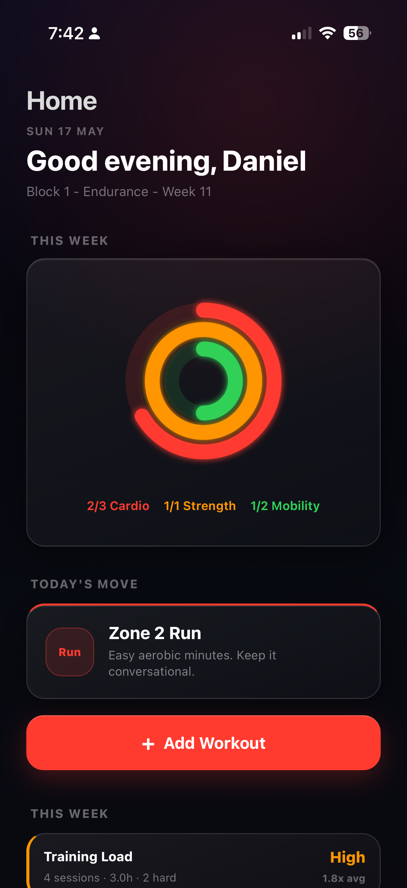
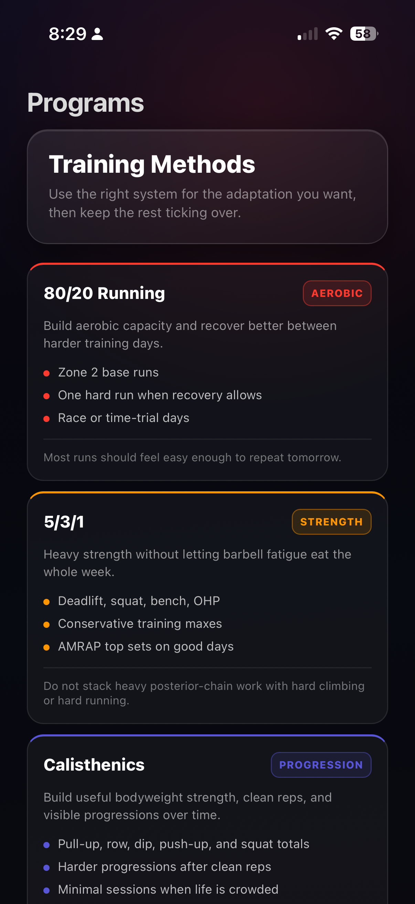
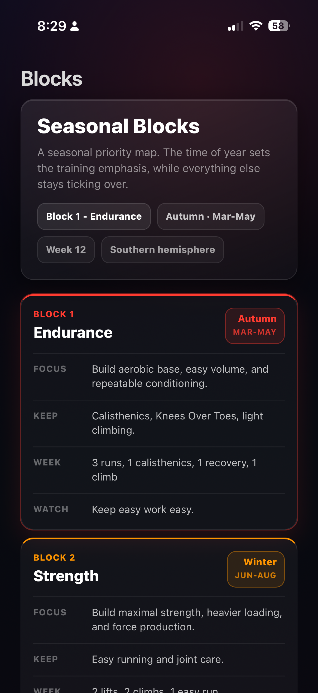

<div align="center">
<pre>
 ██████╗ ██████╗ ███████╗██╗██████╗ ██╗ █████╗ ███╗   ██╗
██╔═══██╗██╔══██╗██╔════╝██║██╔══██╗██║██╔══██╗████╗  ██║
██║   ██║██████╔╝███████╗██║██║  ██║██║███████║██╔██╗ ██║
██║   ██║██╔══██╗╚════██║██║██║  ██║██║██╔══██║██║╚██╗██║
╚██████╔╝██████╔╝███████║██║██████╔╝██║██║  ██║██║ ╚████║
 ╚═════╝ ╚═════╝ ╚══════╝╚═╝╚═════╝ ╚═╝╚═╝  ╚═╝╚═╝  ╚═══╝

███████╗██╗████████╗███╗   ██╗███████╗███████╗███████╗
██╔════╝██║╚══██╔══╝████╗  ██║██╔════╝██╔════╝██╔════╝
█████╗  ██║   ██║   ██╔██╗ ██║█████╗  ███████╗███████╗
██╔══╝  ██║   ██║   ██║╚██╗██║██╔══╝  ╚════██║╚════██║
██║     ██║   ██║   ██║ ╚████║███████╗███████║███████║
╚═╝     ╚═╝   ╚═╝   ╚═╝  ╚═══╝╚══════╝╚══════╝╚══════╝
</pre>
</div>

Obsidian Fitness is a hybrid training system designed to be used forever, with an iOS-style app experience inside your Obsidian vault. Instead of bouncing between multiple fitness apps, it brings your training, programming, and progress into one place.

Everything is stored in plain Markdown, so your training history stays readable and yours forever.

## Why This Exists

1. Fitness apps disappear: I lost years of workout history when my favourite one stopped being maintained.
2. There are too many fitness apps. One for running, another for strength, another for HIIT, yada yada.
3. Training for life needs a system: seasonal blocks, progression, variety, balance, and feedback.

## Core Loop

1. **Open the vault:** Get a recommendation based on your goals and recent training.
2. **Log as you train:** Track sets, reps, or runs on the fly.
3. **Review progress:** Insights and recommendations update automatically.

## Screenshots

<p align="center">
  
  
  
</p>

## Setup

1. Open this folder as an Obsidian vault.
2. Install and enable these community plugins: Templater, Dataview, Meta Bind, and Homepage.
3. Set Templater's templates folder to `System`.
4. Set Templater's user scripts folder to `System`.
5. Enable folder templates for `Workouts` using `System/workout-template.md`.
6. Set `Home.md` as the Homepage page.
7. Enable `.obsidian/snippets/fitness-liquid-glass.css`.

Optional: keep the vault in iCloud Drive, Google Drive, Dropbox, or another synced folder so your training history stays available across devices and backed up outside any one app.

Real workout notes and import files are ignored by git by default.

## Structure

```text
Home.md             Mobile-first daily surface

Progress/
  load.md           Load management and weekly volume
  running.md        5K times, yearly volume, heart-rate trends
  strength.md       Lifts, training maxes, and top sets
  calisthenics.md   Rep volume, records, and progression history
  swimming.md       Swim distance, time, and 1km benchmarks
  history.md        Chronological workout history

Reference/
  blocks.md         Seasonal block guide
  programs.md       Training system reference
  exercises.md      Exercise and progression map

System/
  settings.md       User-editable training settings
  importers/        Apple Health and Garmin import tools
  workoutEngine.js  Templater user script
  workout-template.md
  ui-modules/
  developer-guide.md

Workouts/
  YYYY-MM-DD.md     Personal workout notes generated by Templater
```

## Customize

Use it as-is, or fork it and change the workout types, blocks, metrics, and recommendations to match your own training goals. Because the system is just Markdown, CSS, and small scripts, it is easy to hand to an AI coding assistant and customise in minutes.

- Edit `System/settings.md` for the active block and training numbers.
- Edit `Reference/blocks.md` for block meanings.
- Import Apple Health or Garmin history with `System/importers/import_workouts.py`.
- Update block targets in `Home.md` if you want different recommendations.
- Ask your AI coding assistant to adapt sports, metrics, blocks, weekly targets, and workout inputs.

## License

Licensed under the MIT License. See `LICENSE`.
